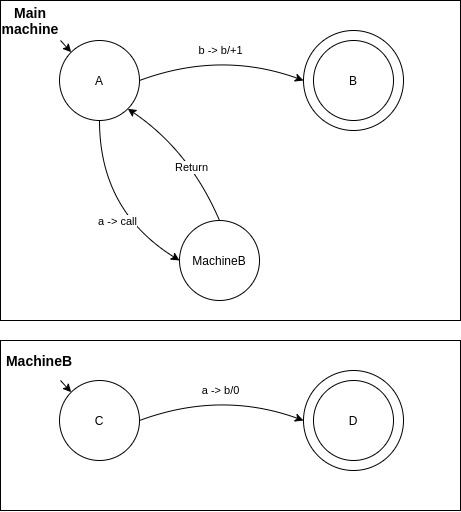

# Turing Machine DSL
DSL for creating TuringMachines in Kotlin

## Turing machine
Turing machine is a mathematical construct that can describe an abstract machine working with states over an infinite tape.
More can be found on [Wikipedia](https://en.wikipedia.org/wiki/Turing_machine)

## Difference of this DSL from formal definition
Main difference from formal definition is the ability to call other Turing machines in form similar to calling function. 



Since it can be looked at as just a syntactic sugar, and the machines can be transformed to exclude the function calling,
it is still a correct Turing machine.

For example, the machine above can be transformed as follows:


Other different thing is that transforming function can move along more than by one tape slot.
This can be also always transformed to formal Turing machine (shown by an example bellow).


### Other formalities
Turing machines built with this DSL have always one end state and its name is stored in `END_STATE` variable.

The 'blank symbol' is always `#`.

Input symbols and working alphabet are not set explicitly, but are interfered from their usage in transitions.

There is a reserved symbol `&` which symbolises 'Do not overwrite the currently read symbol',
so transformation
```
(A, x) -> (B, &, +1)
```
is equivalent to
```
(A, x) -> (B, x, +1)
```
where A and B are states and 'x' is a symbol of the alphabet.

## Basis of DSL
Input function into builders is `buildTuring`.
It accepts a lambda in which you should create correct Turing machine (more on that later). 
In the context of this lambda you can use functions `mainMachine`, `machine`, `input`, `printOutput` and `printOnHalt`.

### machine function
`mainMachine` and `machine` are functionally same functions, but the first one is used to make a 'main' machine executed
upon starting TuringMachineWrapper, and the other is used to make called machines.

usage:
```kotlin
machine ( NAME ) {
    states( VARARGS_OF_STRINGS_OF_STATE_NAMES )
    
    initialState = INITIAL_STATE
    
    // transition function ( STATE, SYMBOL ) -> ( STATE, SYMBOL, INT_MOVE ) 
    tr( STATE, SYMBOL ) goto tr( INT_MOVE, STATE, SYMBOL )
    
    // same as goto, but prints the current symbol on tape before overwriting it
    tr( STATE, SYMBOL ) printGoto tr( INT_MOVE, STATE, SYMBOL )
    
    // executes a machine, then returns to the calling one
    tr( STATE, SYMBOL ) call STRING_MACHINE_NAME
}
```

All the functions can be called freely within the machine context. All states used within `tr` must be set with `states`. 
Initial state bust be set at least once. `mainMachine` must be set once.

### input function
This function sets the initial state of the tape and has only one operator in its context:
```kotlin
Int set String
```

Int signalizes the offset from tape head start and String set the tape content.

```kotlin
0 set "abcd"
// is the same as
0 set "a"
1 set "b"
2 set "c"
3 set "d"
```

### printOutput, printOnHalt
Both functions have the same context, `printOutput` prints on successful ending of TuringMachine and printOnHalt prints if the machine halts.

They both have one input parameter `printBlank` which sets if blank symbols are skipped or printed

They have two functions within their context:
```kotlin
OFFSET lenght LENGTH
message( STRING )
```

Operator `lenght` prints the tape on an index from end OFFSET and reads for LENGTH symbols.  
Function `message` sets a static message to be printed.

### Compilation
Upon exiting the builder lambdas, `buildTuring` "compiles" the machine. If it has syntax error, it prints that error and returns null, 
otherwise it returns TuringMachineWrapper. You can call `print` over this wrapper to pretty print the output, or `start` to start executing 
the machine. `start` also has one parameter `debug: Boolean` which if set to true prints "debug" information about transitions.
